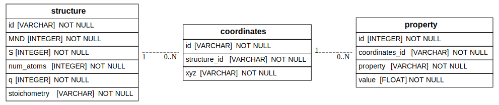

# Database Tutorial Part 2

This repository shows creating a sqlite database from the TMQM dataset obtained from [quamtum-machine.org](http://quantum-machine.org/datasets/).
The dataset is available as a CSV file and an XYZ file. The CSV file contains computed properties of molecules and the XYZ file contains the coordinates of the atoms in the molecules.

This repository shows the organization of the data into a SQLite database with three tables, having the structure shown in the figure below.



The notebook `query_db.ipynb` shows some examples of querying the database using SQLModel and putting results into a pandas DataFrame.

You can obtain the sample database from [the MolSSI server](https://pneuma.chem.vt.edu/tmqm_example/tmqm.db).
You can use `wget` to download the database file as shown below.

```bash
wget https://pneuma.chem.vt.edu/tmqm_example/tmqm.db
```

You may also download the data from quantum-machine.org and create the database yourself using scripts in the `build_db` directory. 
In this case you would first run `download.sh`, then `build_db.py`, followed by `insert_properties.py`. Note that this may take more than 20 minutes to run.